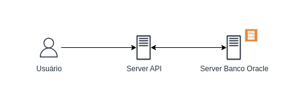
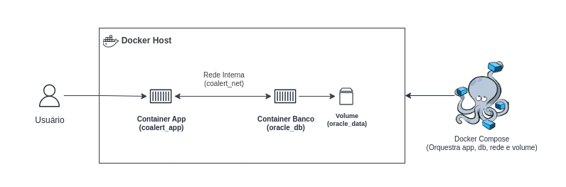

# Co-Alert (Entrega checkpoint DevOps)

## Sumário

***Em negrito são os tópicos importantes para entrega do checkpoint de DevOps***

- [Co-Alert](#co-alert-entrega-checkpoint-devops)
  - [Sumário](#sumário)
  - [Descrição do Projeto](#descrição-do-projeto)
  - [Autores](#autores)
    - [Turma 2TDSR - Análise e Desenvolvimento de Sistemas](#turma-2tdsr---análise-e-desenvolvimento-de-sistemas)
  - [Vídeo de Demonstração](#vídeo-de-demonstração)
  - [Vídeo Pitch](#vídeo-pitch)
  - [Diagramas Database](#diagramas-database)
  - [***Arquitetura Atual***](#arquitetura-atual)
  - [***Arquitetura Futura***](#arquitetura-futura)
  - [Dockerfile](#dockerfile)
  - [***Docker Compose***](#docker-compose)
  - [***Instalação do Projeto via Docker Compose***](#instalação-do-projeto-via-docker-compose--troubleshooting)
    - [Requisitos Docker Compose](#requisitos-docker-compose)
    - [Configuração Docker Compose](#configuração-docker-compose)
    - [Comandos Essenciais do Docker Compose](#comandos-essenciais-do-docker-compose)
    - [Processo de Deploy Passo a Passo](#processo-de-deploy-passo-a-passo)
    - [Troubleshooting Básico](#troubleshooting-básico)
  - [Instalação do Projeto via Docker](#instalação-do-projeto-via-docker)
    - [Requisitos Docker](#requisitos-docker)
    - [Configuração Docker](#configuração-docker)
  - [Instalação do Projeto via Host](#instalação-do-projeto-via-host)
    - [Requisitos Host](#requisitos-host)
    - [Configuração Host](#configuração-host)
    - [Rodar o Projeto Localmente](#rodar-o-projeto-localmente)
      - [Com IDE (Rider ou Visual Studio)](#com-ide-rider-ou-visual-studio)
      - [Sem IDE (usando linha de comando)](#sem-ide-usando-linha-de-comando)
  - [Acesso à API](#acesso-à-api)
  - [Exemplos de Teste da API](#exemplos-de-teste-da-api)
    - [Categoria de Desastre](#categoria-de-desastre)
    - [Localização](#localização)
    - [Usuário](#usuário)
    - [Postagem](#postagem)
    - [Comentário](#comentário)
    - [Like](#like)
  - [Rotas da API](#rotas-da-api)
    - [Categoria de desastre](#categoria-de-desastre-1)
    - [Comentários](#comentários)
    - [Likes](#likes)
    - [Localização](#localização-1)
    - [Postagem](#postagem-1)
    - [Usuário](#usuário-1)

---

## Descrição do Projeto

O Co-Alert surge como uma rede colaborativa de comunicação, que funciona como uma plataforma tipo fórum, permitindo aos usuários compartilhar informações em tempo real sobre desastres naturais e eventos climáticos extremos. Através de publicações detalhadas, que incluem tipo de ocorrência, localização exata e imagens, a comunidade pode acessar informações confiáveis e atualizadas, melhorando a tomada de decisões e a preparação para esses eventos.

Nosso público-alvo é composto por pessoas que vivem em áreas vulneráveis a desastres naturais, indivíduos com acesso limitado a informações oficiais e qualquer pessoa interessada em estar preparada para situações de emergência climática.

Com o Co-Alert, buscamos impactar positivamente a vida dessas pessoas, reduzindo a desinformação e os alarmes falsos, facilitando o fluxo rápido e acessível de dados relevantes, para que possam agir com segurança e antecedência.

Este projeto responde a um desafio crescente: o aumento de até 460% nos desastres climáticos no Brasil desde os anos 1990, comprovando a necessidade de ferramentas eficientes para comunicação e prevenção

Essa integração permite o acompanhamento via aplicativo, promovendo **eficiência, segurança e organização**. O sistema também gerencia cadastro/edição de dados, autenticação/autorização, gestão de permissões e dashboards com relatórios para tomada de decisão.

---

## Autores

### Turma 2TDSR - Análise e Desenvolvimento de Sistemas

* Daniel Saburo Akiyama - RM 558263
* Danilo Correia e Silva - RM 557540
* João Pedro Rodrigues da Costa - RM 558199

---

## Vídeo de Demonstração

[Link vídeo de demonstração](https://youtu.be/4SEC_q7I8_M)

[](https://www.youtube.com/watch?v=4SEC_q7I8_M)

---

## Vídeo Pitch

[Link vídeo pitch](https://www.youtube.com/watch?v=jo6uayD35yI)

[](https://www.youtube.com/watch?v=jo6uayD35yI)

---

## Diagramas Database


*Diagrama para MVP — ainda passível de várias melhorias.*

---

## Arquitetura Atual



A arquitetura atual do Co-Alert utiliza uma abordagem **tradicional monolítica**, onde:

- A aplicação e o banco de dados estão rodando em **servidores separados**.
- O **deploy é manual**, realizado via cópia de arquivos e configuração direta no servidor.
- Cada ambiente (desenvolvimento, teste e produção) é configurado de forma independente, o que gera **inconsistências**.
- Não há **orquestração** de serviços ou padronização de ambiente.
- O banco de dados depende de **infraestrutura física**, com risco de perda de dados caso o servidor seja reiniciado ou corrompido.

Essa arquitetura apresenta dificuldades de escalabilidade e manutenção, além de processos lentos de deploy.

---

## Arquitetura Futura



Após a modernização utilizando **Docker Compose**, a arquitetura do Co-Alert passa a ser baseada em **containers**, oferecendo:

- **Container da aplicação** (Co-Alert) e **container do banco de dados** (Oracle XE).
- **Rede interna Docker (`coalert_net`)** para comunicação segura entre os containers.
- **Volumes** para persistência dos dados do banco (`oracle_data`).
- **Docker Compose** orquestrando o deploy, garantindo que todos os serviços sejam iniciados e conectados corretamente.
- Ambientes padronizados e reproduzíveis, permitindo **deploy contínuo** e confiável.
- Maior **escalabilidade** e **isolamento** de serviços, reduzindo dependência da infraestrutura física.

---

## Dockerfile

Dockerfile de desenvolvimento sem migração (mais leve):
[Dockerfile Development](./CoAlert/Dockerfile.dev)

Dockerfile de desenvolvimento com migração (mais pesada):
[Dockerfile Development Migration](./CoAlert/Dockerfile.dev-migration)

Imagem Docker Hub: [Imagem Docker Hub com as duas Tags](https://hub.docker.com/repository/docker/danielakiyama/coalert/general)

**Observação**: Em produção, o ideal é usar a imagem aspnet apenas para executar a aplicação, deixando as migrações para serem feitas fora do container ou em um container separado com o SDK. Isso torna a imagem final mais leve e segura. Contudo, optamos por utilizar o SDK na imagem para facilitar o desenvolvimento do projeto.

---

## Docker Compose

O **Docker Compose** é responsável por **orquestrar todos os serviços**, facilitando o deploy e a gestão dos containers.  
Ele define quais containers serão criados, como se comunicam, quais volumes serão usados e as variáveis de ambiente de cada serviço.

O docker-compose.yml é um arquivo de configuração em YAML que define como os containers devem ser criados e executados.
Você pode conferir o arquivo `docker-compose.yml` do projeto aqui:  
[Docker Compose yml](./docker-compose.yml)

- **Serviços definidos:**
  - `oracle` → banco de dados Oracle XE
  - `coalert` → aplicação Co-Alert
- **Redes:**
  - `coalert_net` conecta os containers de forma segura e isolada.
- **Volumes:**
  - `oracle_data` mapeado para persistir os dados do banco.
- **Variáveis de ambiente:** configuram usuários, senhas e endpoints do banco.
- **Healthchecks:** garantem que cada serviço esteja operacional antes de prosseguir com a inicialização.
- **Política de restart:** `unless-stopped` para maior confiabilidade.
- **Execução com usuário sem privilégios administrativos:** aumenta a segurança do container da aplicação.

O Docker Compose torna a **arquitetura moderna, escalável e confiável**, substituindo processos manuais e padronizando todo o ambiente de execução.

---

## Instalação do Projeto via Docker Compose & Troubleshooting

### Requisitos Docker Compose

- Docker e Docker Compose instalado e com a engine ligada
- Máquina com recursos suficientes para rodar os containers (CPU, RAM, disco).
- Conexão com a internet para baixar as imagens oficiais.

---

### Configuração Docker Compose

1. Clone o projeto:

```bash
git clone https://github.com/danielthx23/docker-compose-checkpoint.git
cd CoAlert
```

2. Certifique-se de que o `docker-compose.yml` está na raiz do projeto e com as variáveis de ambiente corretas.

---

### Comandos Essenciais do Docker Compose

* Subir todos os serviços e reconstruir as imagens (app + banco):

```bash
docker compose up -d --build
```

* Ver logs dos containers:

```bash
docker compose logs -f
```

* Parar os serviços e remover containers, redes e volumes:

```bash
docker compose down -v
```

* Listar containers em execução:

```bash
docker compose ps
```

* Reconstruir a imagem da aplicação (sem subir containers):

```bash
docker compose build coalert
```

---

### Processo de Deploy Passo a Passo

1. Configurar variáveis de ambiente no yml ou diretamente eu um .env.
2. Executar `docker compose up -d --build` para buildar as imagens subir os containers.
3. Aguardar até que os **healthchecks** indiquem que os serviços estão saudáveis.
4. Verificar se a aplicação está acessível via browser:

* API/Swagger: `http://localhost:5024/swagger`
* Razor App: `http://localhost:5024/`
5. Executar migrations automaticamente (caso `RUN_MIGRATIONS=true`).
6. Testar CRUDs no banco via API para garantir que tudo está funcionando.

---

### Troubleshooting Básico

* **Container do banco não inicia:**

  * Verifique se a porta `1521` não está ocupada.
  * Confira variáveis de ambiente (usuário, senha, SID).
  * Confira logs: `docker-compose logs -f oracle`.

* **Aplicação não consegue conectar ao banco:**

  * Verifique se o nome do host no `docker-compose.yml` corresponde ao serviço do banco (`oracle`).
  * Certifique-se que os containers estão na mesma rede (`coalert_net`).

* **Erro de porta já em uso:**

  * Altere a porta mapeada no `docker-compose.yml` ou libere a porta ocupada.

* **Problemas de persistência:**

  * Confira se o volume `oracle_data` está corretamente definido e com permissões de leitura/escrita.

* **Logs do container app:**

```bash
docker-compose logs -f coalert
```

* Útil para verificar falhas na aplicação ou problemas de migrations.

---

## Instalação do Projeto via Docker

### Requisitos Docker
- Docker instalado e com a engine ligada

### Configuração Docker

1. Clone o projeto:

```bash
git clone https://github.com/danielthx23/docker-compose-checkpoint.git
cd CoAlert
```

2. Rode um container utilizando variaveis de ambiente e a imagem no Docker Hub pelo build

Utilize o comando abaixo, substituindo meuusuario e minhasenha com suas credenciais do Oracle DB:

```bash
  # Esse comando só funciona em bash por conta do \
  docker run -d \
  -e ORACLE_USER=seuusuario \
  -e ORACLE_PASSWORD=suasenha \
  -e ORACLE_HOST=oracle.fiap.com.br \
  -e ORACLE_PORT=1521 \
  -e ORACLE_SERVICE_NAME=ORCL \
  -e RUN_MIGRATIONS=true \
  -p 5024:5024 \
  danielakiyama/coalert:development-migration-v1.0.0
```

Em uma linha só (recomendado):
```bash
  # Funciona no CMD e Bash (recomendado)
  docker run -d -e ORACLE_USER=seuusuario -e ORACLE_PASSWORD=suasenha -e ORACLE_HOST=oracle.fiap.com.br -e ORACLE_PORT=1521 -e ORACLE_SERVICE_NAME=ORCL -e RUN_MIGRATIONS=true -p 5024:5024 danielakiyama/coalert:development-migration-v1.0.0
```

OU, se não quiser rodar as migrations:

```bash
  # Esse comando só funciona em bash por conta do \
  docker run -d \
  -e ORACLE_USER=seuusuario \
  -e ORACLE_PASSWORD=suasenha \
  -e ORACLE_HOST=oracle.fiap.com.br \
  -e ORACLE_PORT=1521 \
  -e ORACLE_SERVICE_NAME=ORCL \
  -p 5024:5024 \
  danielakiyama/coalert:development-v1.0.0
```

Em uma linha só (recomendado):
```bash
  # Funciona no CMD e Bash (recomendado)
  docker run -d -e ORACLE_USER=seuusuario -e ORACLE_PASSWORD=suasenha -e ORACLE_HOST=oracle.fiap.com.br -e ORACLE_PORT=1521 -e ORACLE_SERVICE_NAME=ORCL -p 5024:5024 danielakiyama/coalert:development-v1.0.0
```

Legendas:

```bash
docker run -d \
  -e ORACLE_USER=seuusuario           # Usuário do banco Oracle
  -e ORACLE_PASSWORD=suasenha        # Senha do usuário Oracle
  -e ORACLE_HOST=oracle.fiap.com.br  # Host do banco Oracle
  -e ORACLE_PORT=1521                # Porta do banco Oracle (geralmente 1521)
  -e ORACLE_SERVICE_NAME=ORCL                 # SID da instância Oracle
  -e RUN_MIGRATIONS=true             # Controla se as migrações serão executadas na inicialização (true/false)
  -p 5024:5024                      # Mapeia a porta 5169 do container para a mesma porta na máquina host
  danielakiyama/mottracker:<tags diferentes>  # Nome da imagem e tag Docker a ser executada, lembrando Development (leve) não roda migrations, Development-Migration (pesada) roda.
```

## Instalação do Projeto via Host

### Requisitos Host
- .NET SDK 8.0 instalado
- Rider / Visual Studio instalado (opcional)

### Configuração Host

1. Clone o projeto:

```bash
git clone https://github.com/danielthx23/docker-compose-checkpoint.git
cd CoAlert
```

2. No arquivo `appsettings.Development.json`, configure e adicione a string de conexão do Oracle DB com seu usuário e senha, por exemplo:

```json
"ConnectionStrings": {
  "Oracle": "Data Source=(DESCRIPTION=(ADDRESS_LIST=(ADDRESS=(PROTOCOL=TCP)(HOST=seuhost)(PORT=suaporta)))(CONNECT_DATA=(SERVER=DEDICATED)(SID=seusid)));User Id=seuusuario;Password=suasenha;"
}
```

Ou crie um arquivo .env no diretório do projeto contendo:

```bash
  ORACLE_USER=seuusuario
  ORACLE_PASSWORD=suasenha
  ORACLE_HOST=seuhost
  ORACLE_PORT=suaporta
  ORACLE_SERVICE_NAME=seusn
```

3. Execute as migrations para criar as tabelas no banco Oracle:

   (entre no diretório do projeto primeiro)

```bash
  dotnet ef database update
```

Caso não tenha a ferramenta dotnet-ef instalada, instale com:

```bash
  dotnet tool install --global dotnet-ef
```

### Rodar o Projeto Localmente

Após configurar a string de conexão e aplicar as migrations, você pode rodar a API de duas maneiras:

#### Com IDE (Rider ou Visual Studio)

1. Abra a solução no Rider ou Visual Studio.
2. Selecione o projeto da API como *Startup Project*.
3. Clique em **Run** com o perfil `http`.

#### Sem IDE (usando linha de comando)

1. **Restaurar e compilar:**

- Para rodar o backend, entre no diretório `CoAlert_DotNet` antes de executar o comando.

- Caso deseje rodar o backend de dentro do diretório do projeto .net, altere o caminho e remova a flag `--project CoAlert` no comando correspondente.

```bash
dotnet restore CoAlert/CoAlert.csproj
dotnet build
```

2. **Rodar o projeto:**

```bash
dotnet run --project CoAlert --urls "http://localhost:5024"
```

## Acesso à API

- Aplicação Razor: [http://localhost:5024/](http://localhost:5024/)


- Swagger: [http://localhost:5024/swagger](http://localhost:5024/swagger/index.html)


- API: [http://localhost:5024/api](http://localhost:5024/api/)

## Exemplos de Teste da API

### Categoria de Desastre

**Exemplo POST**

```json
{
  "nmTitulo": "Enchente Urbana",
  "dsCategoria": "Desastres relacionados ao acúmulo de água em áreas urbanas devido a chuvas intensas.",
  "nmTipo": "Hidrológico"
}
```

**Exemplo PUT**

```json
{
  "nmTitulo": "Enchente Urbana Moderada",
  "dsCategoria": "Inundações em áreas urbanas causadas por chuvas acima da média, com impactos localizados.",
  "nmTipo": "Hidrológico"
}
```

---

### Localização

**Exemplo POST**

```json
{
  "nmBairro": "Centro",
  "nmLogradouro": "Rua das Flores",
  "nrNumero": 123,
  "nmCidade": "São Paulo",
  "nmEstado": "SP",
  "nrCep": "01001-000",
  "nmPais": "Brasil",
  "dsComplemento": "Apartamento 101"
}
```

**Exemplo utilizado no vídeo de DevOps:**

```json
{
  "nmBairro": "Jardim Papai",
  "nmLogradouro": "Rua Luiz Batista da Silva",
  "nrNumero": 15,
  "nmCidade": "Ferraz de Vasconcelos",
  "nmEstado": "São Paulo",
  "nrCep": "08505-361",
  "nmPais": "Brasil",
  "dsComplemento": "Casa"
}
```

**Exemplo PUT**

```json
{
  "nmBairro": "Centro",
  "nmLogradouro": "Rua das Palmeiras",
  "nrNumero": 456,
  "nmCidade": "São Paulo",
  "nmEstado": "SP",
  "nrCep": "01001-001",
  "nmPais": "Brasil",
  "dsComplemento": "Bloco B, Apt. 202"
}
```

---

### Usuário

**Exemplo POST**

```json
{
  "nmUsuario": "joaosilva",
  "nrSenha": "SenhaForte123!",
  "nmEmail": "joao.silva@email.com"
}
```

**Exemplo utilizado no vídeo de DevOps:**

```json
{
  "nmUsuario": "Carolina Correia e Silva",
  "nrSenha": "carol123",
  "nmEmail": "carol123@gmail.com"
}
```

**Exemplo PUT**

```json
{
  "nmUsuario": "joaosilva_atualizado",
  "nrSenha": "NovaSenhaSegura456!",
  "nmEmail": "joao.silva.novo@email.com"
}
```

---

### Postagem

**Exemplo POST**

```json
{
  "nmTitulo": "Deslizamento em encosta",
  "nmConteudo": "Foi registrado um deslizamento de terra em uma área de risco após fortes chuvas.",
  "usuarioId": COLOQUE_O_ID_DO_USUARIO,
  "categoriaDesastreId": COLOQUE_O_ID_DA_CATEGORIA,
  "localizacaoId": COLOQUE_O_ID_DA_LOCALIZACAO
}
```

**Exemplo utilizado no vídeo de DevOps:**

```json
{
  "nmTitulo": "Na tarde do dia 6 de junho de 2025, uma forte chuva atingiu Ferraz de Vasconcelos, na Região Metropolitana de São Paulo, provocando enchentes em diversos bairros, especialmente no Jardim Castelo e no Parque São Francisco.",
  "nmConteudo": "Ruas ficaram completamente alagadas, impedindo a passagem de veículos e pedestres. Moradores relataram que a água invadiu casas, causando perdas materiais e riscos à saúde. A Defesa Civil foi acionada, mas houve demora no atendimento devido à alta demanda. A população cobra medidas   
urgentes de drenagem e manutenção das galerias pluviais para evitar novos episódios como este.",
  "usuarioId": COLOQUE_O_ID_DO_USUARIO,
  "categoriaDesastreId": COLOQUE_O_ID_DA_CATEGORIA,
  "localizacaoId": COLOQUE_O_ID_DA_LOCALIZACAO
}
```

**Exemplo PUT**

```json
{
  "nmTitulo": "Deslizamento em encosta atualizado",
  "nmConteudo": "Atualização: o deslizamento afetou três residências e interditou a rua principal.",
  "usuarioId": COLOQUE_O_ID_DO_USUARIO,
  "categoriaDesastreId": COLOQUE_O_ID_DA_CATEGORIA,
  "localizacaoId": COLOQUE_O_ID_DA_LOCALIZACAO
}
```

---

### Comentário

**Exemplo POST**

```json
{
  "nmConteudo": "Excelente relato, obrigado por compartilhar!",
  "usuarioId": COLOQUE_O_ID_DO_USUARIO,
  "postagemId": COLOQUE_O_ID_DA_POSTAGEM
}
```

**Exemplo PUT**

```json
{
  "nmConteudo": "Atualizando meu comentário: a situação foi resolvida pela Defesa Civil.",
  "usuarioId": COLOQUE_O_ID_DO_USUARIO,
  "postagemId": COLOQUE_O_ID_DA_POSTAGEM
}
```

---

### Like

**Exemplo POST**

```json
{
  "usuarioId": COLOQUE_O_ID_DO_USUARIO,
  "postagemId": COLOQUE_O_ID_DA_POSTAGEM
}
```

## Rotas da API

### Categoria de desastre

| Método | Rota                                 | Descrição                             |
| ------ | ------------------------------------ | ------------------------------------- |
| GET    | `/categoria-desastre`                 | Lista todas as categorias de desastre |
| POST   | `/categoria-desastre`                 | Cria uma nova categoria               |
| GET    | `/categoria-desastre/{id}`            | Obtém categoria por ID                |
| PUT    | `/categoria-desastre/{id}`            | Atualiza uma categoria                |
| DELETE | `/categoria-desastre/{id}`            | Deleta uma categoria                  |
| GET    | `/categoria-desastre/tipo/{tipo}`     | Obtém categorias por tipo             |
| GET    | `/categoria-desastre/titulo/{titulo}` | Obtém categorias por título           |

### Comentários

| Método | Rota                                   | Descrição                  |
| ------ | -------------------------------------- | -------------------------- |
| GET    | `/comentario`                          | Lista todos os comentários |
| POST   | `/comentario`                          | Cria um novo comentário    |
| GET    | `/comentario/{id}`                     | Obtém comentário por ID    |
| PUT    | `/comentario/{id}`                     | Atualiza um comentário     |
| DELETE | `/comentario/{id}`                     | Deleta um comentário       |
| GET    | `/comentario/postagem/{postagemId}`    | Comentários por postagem   |
| GET    | `/comentario/usuario/{usuarioId}`      | Comentários por usuário    |
| GET    | `/comentario/respostas/{comentarioId}` | Respostas de um comentário |

### Likes

| Método | Rota                              | Descrição              |
| ------ |-----------------------------------| ---------------------- |
| POST   | `/like/toggle`                    | Alternar curtida       |
| GET    | `/like/postagem/{postagemId}`     | Curtidas da postagem   |
| GET    | `/like/comentario/{comentarioId}` | Curtidas do comentário |
| GET    | `/like/usuario/{usuarioId}`       | Curtidas do usuário    |

### Localização

| Método | Rota                           | Descrição                   |
| ------ | ------------------------------ | --------------------------- |
| GET    | `/localizacao`                 | Lista todas as localizações |
| POST   | `/localizacao`                 | Cria uma nova localização   |
| GET    | `/localizacao/{id}`            | Obtém localização por ID    |
| PUT    | `/localizacao/{id}`            | Atualiza uma localização    |
| DELETE | `/localizacao/{id}`            | Deleta uma localização      |
| GET    | `/localizacao/cidade/{cidade}` | Localizações por cidade     |
| GET    | `/localizacao/estado/{estado}` | Localizações por estado     |
| GET    | `/localizacao/cep/{cep}`       | Localização por CEP         |

### Postagem

| Método | Rota                                         | Descrição                 |
| ------ |----------------------------------------------| ------------------------- |
| GET    | `/postagem`                                  | Lista todas as postagens  |
| POST   | `/postagem`                                  | Cria uma nova postagem    |
| GET    | `/postagem/{id}`                             | Obtém postagem por ID     |
| PUT    | `/postagem/{id}`                             | Atualiza uma postagem     |
| DELETE | `/postagem/{id}`                             | Deleta uma postagem       |
| GET    | `/postagem/usuario/{usuarioId}`              | Postagens por usuário     |
| GET    | `/postagem/categoria-desastre/{categoriaId}` | Postagens por categoria   |
| GET    | `/postagem/localizacao/{localizacaoId}`      | Postagens por localização |

### Usuário

| Método | Rota                  | Descrição               |
| ------ |-----------------------| ----------------------- |
| GET    | `/usuario`            | Lista todos os usuários |
| POST   | `/usuario`            | Cria um novo usuário    |
| GET    | `/usuario/{id}`       | Obtém usuário por ID    |
| PUT    | `/usuario/{id}`       | Atualiza um usuário     |
| DELETE | `/usuario/{id}`       | Deleta um usuário       |
| POST   | `/usuario/autenticar` | Autentica um usuário    |
